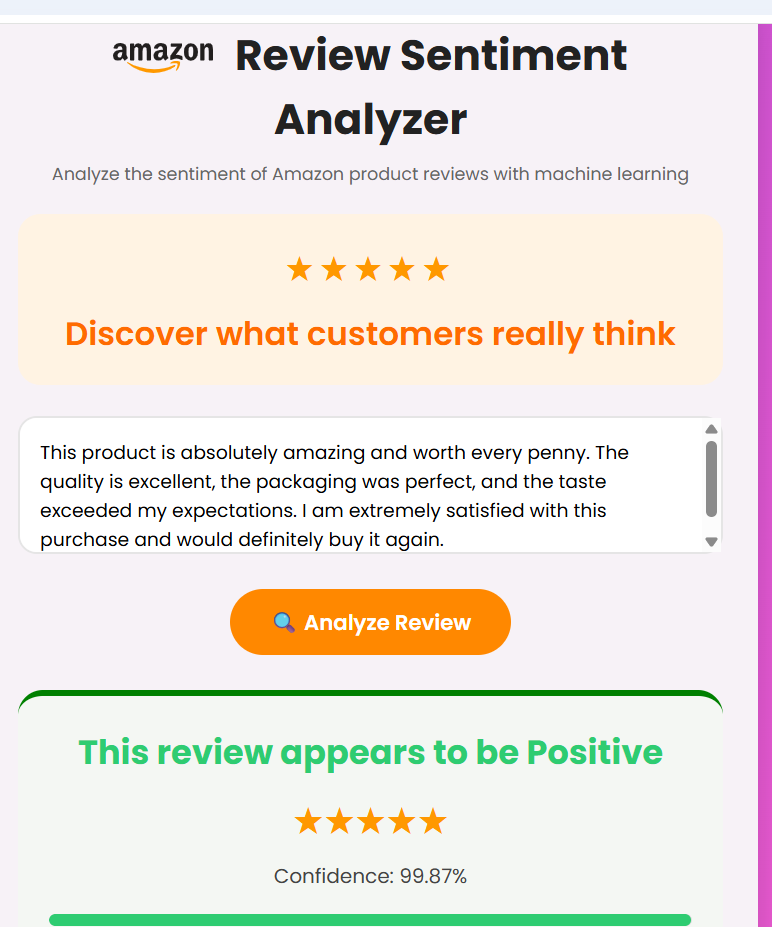

📊 Customer Feedback Sentiment Analysis Using NLP & Deep Learning (LSTM)

  

# 📊 Customer Feedback Sentiment Analysis Using NLP & Deep Learning (LSTM)
📌 Project Overview

This project is an NLP-based Sentiment Analysis System that classifies customer reviews into:

😊 Positive
😐 Neutral
😡 Negative

It uses a Deep Learning LSTM (Long Short-Term Memory) model to understand the context and sequence of words in reviews and predict sentiment in real time.

A Flask web application is used to deploy the model for user interaction.

🚀 Features
Real-time sentiment prediction
Deep Learning (LSTM) based model
Tokenization + Padding pipeline
Confidence score display
Clean and responsive web UI
Color-coded sentiment output
Flask backend integration
🧠 Tech Stack
Python
Flask
TensorFlow / Keras
NumPy
HTML / CSS
NLP (Tokenizer, Padding)
📊 Model Workflow
Review Input
   ↓
Tokenizer
   ↓
Text → Sequences
   ↓
Padding (fixed length)
   ↓
LSTM Model
   ↓
Dense Layer (Softmax)
   ↓
Sentiment Prediction
📁 Project Structure
Project Folder
│
├── app.py
├── lstm_model.h5
├── tokenizer.pkl
├── requirements.txt
│
├── templates/
│   └── index.html
│
├── static/
│   └── style.css
│
└── README.md
📂 Dataset Information

The dataset contains Amazon food product reviews including:

Snacks
Coffee / Tea
Chocolates
Baby food
Organic products
Sentiment Labels:
Score	Sentiment
1–2	Negative
3	Neutral
4–5	Positive
⚙️ Installation & Setup
1. Clone Repository
git clone <your-repo-link>
cd project-folder
2. Install Dependencies
pip install -r requirements.txt
3. Run Application
python app.py
4. Open in Browser
http://127.0.0.1:5000
🧪 Example Test Cases
😊 Positive Review

"This product is amazing and worth every penny. Excellent quality and fast delivery."

😡 Negative Review

"Worst product ever. Very poor quality and waste of money. Completely disappointed."

😐 Neutral Review

"The product is okay. Not too good and not too bad."

📈 Model Output

The system provides:

Sentiment Prediction
Confidence Score (e.g., 98.51%)
Visual Feedback (color-coded UI)
🔮 Future Improvements
Upgrade to BiLSTM or GRU
Use Transformer models (BERT)
Add dashboard analytics
Deploy on cloud (AWS / Render / HuggingFace)
Add CSV batch prediction feature
🎯 Conclusion

This project successfully demonstrates how Deep Learning (LSTM) can be used for automated sentiment analysis of customer reviews.

It helps businesses understand customer feedback efficiently and in real time.

👨‍💻 Author

Shubhangi Salve

⭐ If you like this project

Give a ⭐ on the repository to support the project!